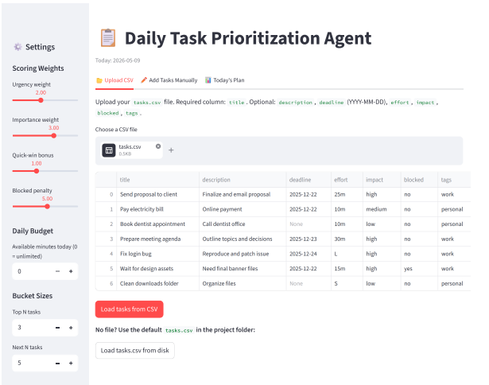
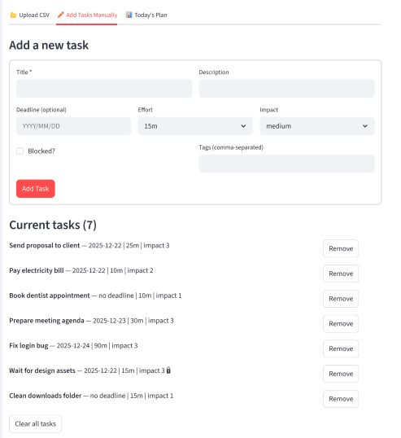
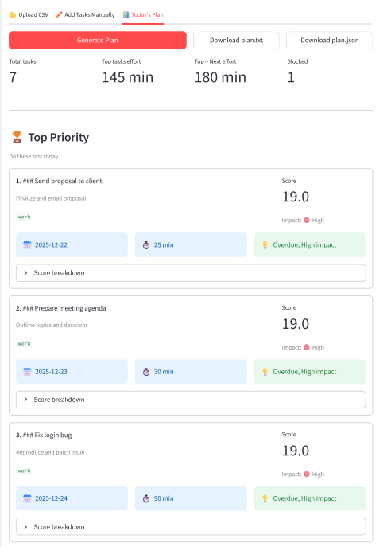
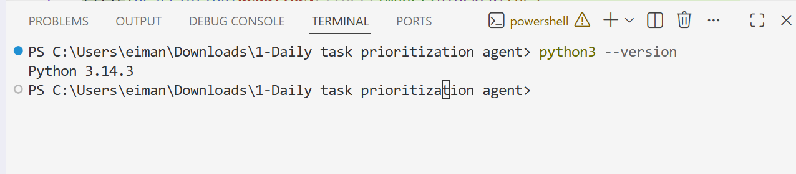
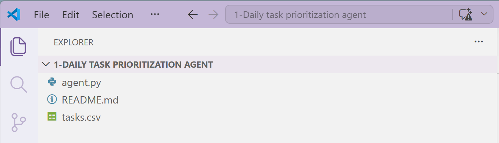
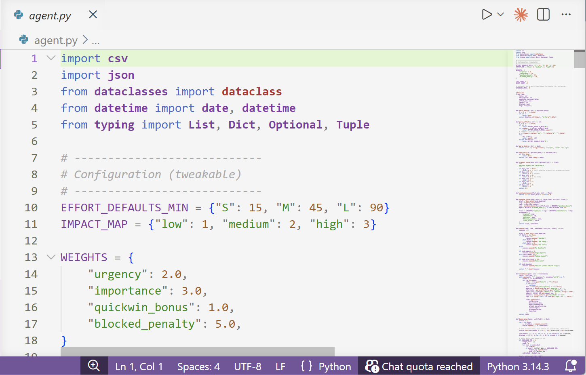
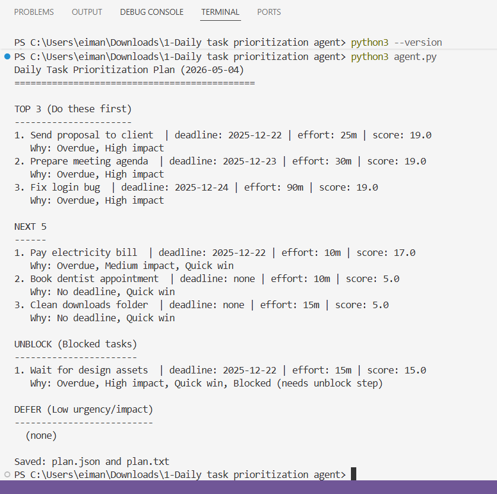
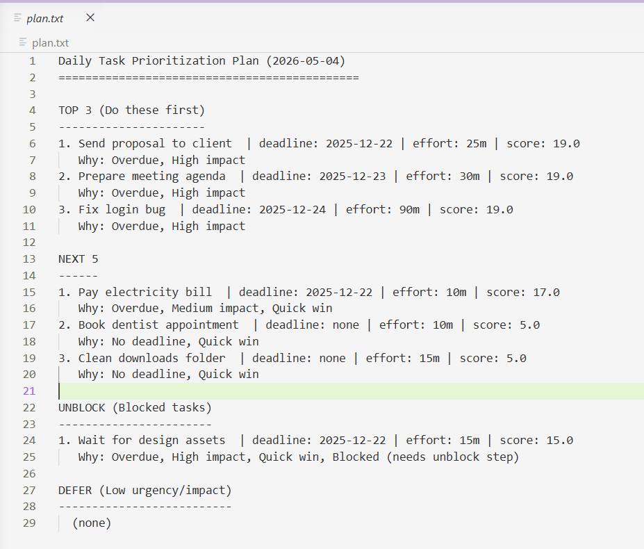
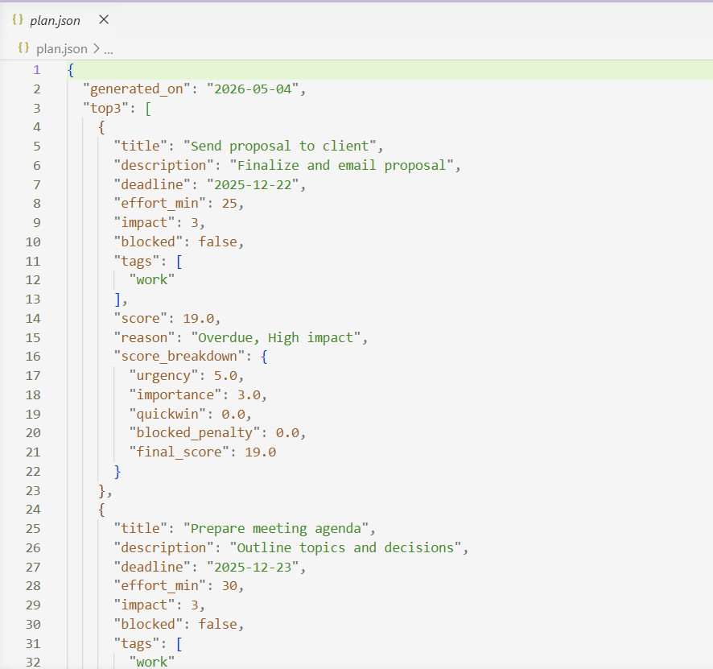

# 🗂️ Daily Task Prioritization Agent

A Python CLI agent that reads your tasks from a CSV file, scores them using a weighted priority formula, and generates a structured daily plan — saved as both `plan.json` and `plan.txt`.

Deployed agent  link:https://100-ai-agents-independent-projects-gtexgvkzbk7adldn55f5uk.streamlit.app/

<table>
  <tr>
    <td width="33%" valign="center">
      
    </td>
    <td width="34%" valign="center">
      
    </td>
    <td width="33%" valign="center">
      
    </td>
  </tr>
</table>

---

## 📁 Project Structure

```
daily-priority-agent/
├── agent.py        # Main agent script
├── tasks.csv       # Your input tasks
├── plan.json       # Output: structured JSON plan (auto-generated)
├── plan.txt        # Output: human-readable plan (auto-generated)
└── README.md       # This file
```

---

## ⚙️ How It Works

The agent scores every task using this formula:

```
score = (urgency × 2.0) + (importance × 3.0) + quickwin_bonus − blocked_penalty
```

| Factor           | Description                                           |
|------------------|-------------------------------------------------------|
| **Urgency**      | Based on days until deadline (overdue = 5.0, no DL = 0.5) |
| **Importance**   | low=1, medium=2, high=3                               |
| **Quick Win**    | +1.0 bonus if effort ≤ 15 minutes                    |
| **Blocked**      | −5.0 penalty if task is blocked                      |

Tasks are then sorted into four buckets:

- **TOP 3** — Do these first today
- **NEXT 5** — Do these after the top 3
- **UNBLOCK** — Blocked tasks that need action to unblock
- **DEFER** — Low urgency + low impact tasks

---

## 🚀 Setup & Run in VS Code (Step by Step)

### Step 1 — Prerequisites

Make sure you have Python installed:

```bash
python3 --version
```

You should see something like `Python 3.10.x` or higher.
<p align="center">
  
</p>

---

### Step 2 — Open Project in VS Code

1. Create a new folder called `daily-priority-agent`
2. Open VS Code
3. Go to **File → Open Folder** and select `Daily task prioritization agent`


---

### Step 3 — Create the Files

In VS Code's Explorer panel, create three files:
- `tasks.csv`
- `agent.py`
- `README.md`

You can right-click in the Explorer sidebar → **New File**.

<p align="center">
  
</p>
---

### Step 4 — Paste the Code

Copy the contents of `agent.py` and `tasks.csv` from this repo into your local files and save them (`Ctrl+S` / `Cmd+S`).

<p align="center">
  
</p>

---

### Step 5 — Open the Integrated Terminal

In VS Code, open the terminal:
- **Windows/Linux:** `` Ctrl+` ``
- **Mac:** `` Cmd+` ``

Or go to **Terminal → New Terminal** from the top menu.

Make sure you're inside the project folder:

```bash
cd path/to/Daily-task-prioritization-agent
```


---

### Step 6 — Run the Agent

```bash
python3 agent.py
```

On Windows you may use:

```bash
python agent.py
```

<p align="center">
  
</p>
---

### Step 7 — Check the Output Files

After running, two files are created:
- `plan.txt` — human-readable daily plan
- `plan.json` — structured data for automation

Open `plan.txt` in VS Code to see your plan.

<p align="center">
  
</p>

---

### Step 8 — (Optional) View plan.json

Open `plan.json` to see the full structured output including score breakdowns.

<p align="center">
  
</p>

---

## 📝 Input Format (tasks.csv)

| Column        | Required | Format / Values                          |
|---------------|----------|------------------------------------------|
| `title`       | ✅ Yes   | Plain text                               |
| `description` | No       | Plain text                               |
| `deadline`    | No       | `YYYY-MM-DD` or leave blank              |
| `effort`      | No       | `10m`, `25m`, `S`, `M`, `L`             |
| `impact`      | No       | `low`, `medium`, `high`                  |
| `blocked`     | No       | `yes` / `no`                             |
| `tags`        | No       | Comma-separated e.g. `work,urgent`       |

**Effort size guide:**
- `S` = 15 min
- `M` = 45 min
- `L` = 90 min

---

## 🔧 Customizing the Weights

Open `agent.py` and find the `WEIGHTS` block near the top:

```python
WEIGHTS = {
    "urgency": 2.0,
    "importance": 3.0,
    "quickwin_bonus": 1.0,
    "blocked_penalty": 5.0,
}
```

**Examples:**
- Want deadlines to dominate? → Set `"urgency": 4.0`
- Want importance to dominate? → Set `"importance": 5.0`
- Want to ignore quick-wins? → Set `"quickwin_bonus": 0.0`

---

## ⏱️ Daily Time Budget (Optional)

You can limit which tasks are included based on how much time you have today.

In `agent.py`, find:

```python
AVAILABLE_MIN = 0  # 0 = unlimited
```

Change it to your available minutes, for example:

```python
AVAILABLE_MIN = 120  # only schedule tasks that fit within 2 hours
```

---

## 📤 Sample Output (plan.txt)

```
Daily Task Prioritization Plan (2025-05-04)
=============================================

TOP 3 (Do these first)
----------------------
1. Send proposal to client  | deadline: 2025-12-22 | effort: 25m | score: 19.0
   Why: Due soon, High impact
2. Pay electricity bill  | deadline: 2025-12-22 | effort: 10m | score: 15.0
   Why: Due soon, Medium impact, Quick win
3. Prepare meeting agenda  | deadline: 2025-12-23 | effort: 30m | score: 19.0
   Why: Due soon, High impact

NEXT 5
------
1. Fix login bug  | deadline: 2025-12-24 | effort: 90m | score: 16.0
   Why: Due soon, High impact

UNBLOCK (Blocked tasks)
-----------------------
1. Wait for design assets  | deadline: 2025-12-22 | effort: 15m | score: 5.0
   Why: Due soon, High impact, Quick win, Blocked (needs unblock step)

DEFER (Low urgency/impact)
--------------------------
1. Book dentist appointment  | deadline: none | effort: 10m | score: 2.5
   Why: No deadline, Low impact, Quick win
```

---

## 🤝 Contributing

Feel free to fork this repo, open issues, or submit PRs to improve the scoring logic, add new fields, or build a web UI on top.

---

## 📄 License

MIT License — free to use and modify.
